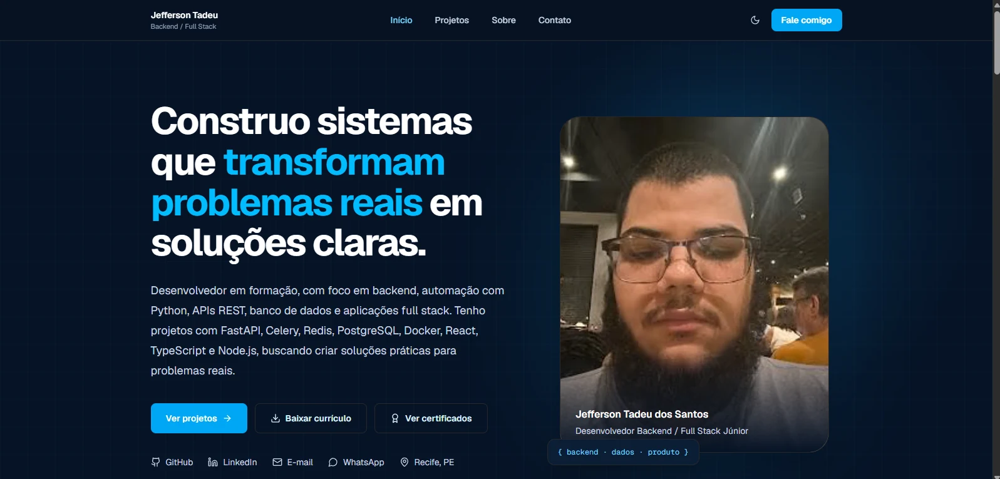
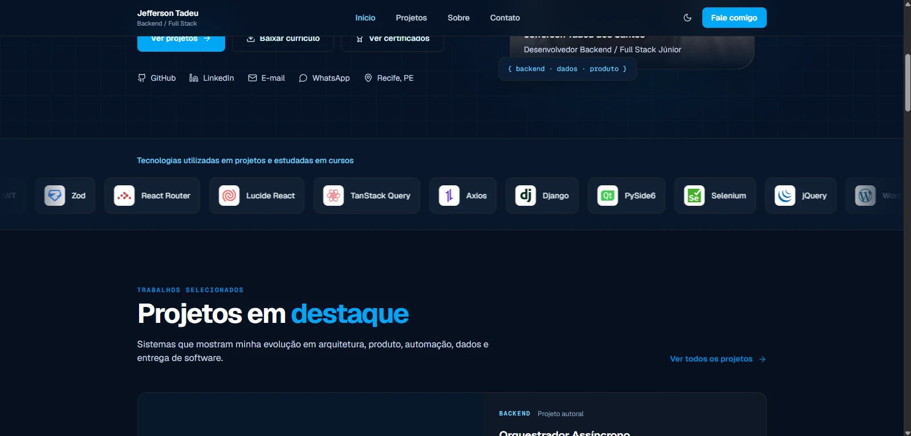
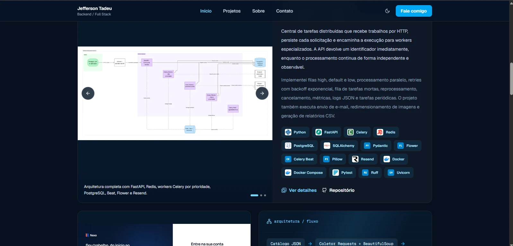
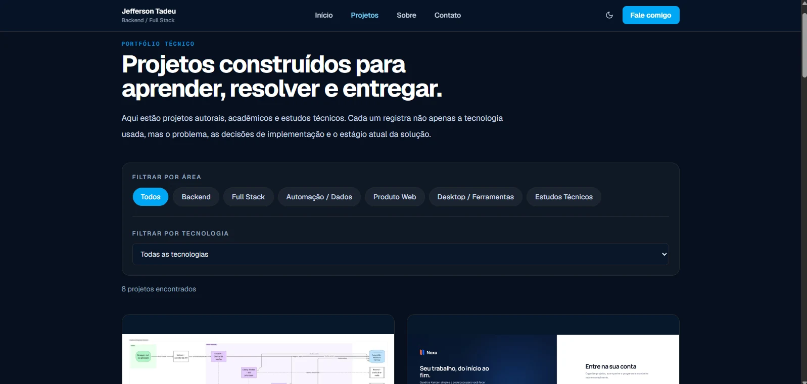
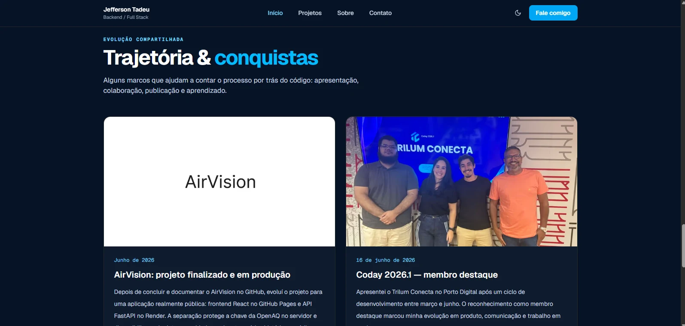
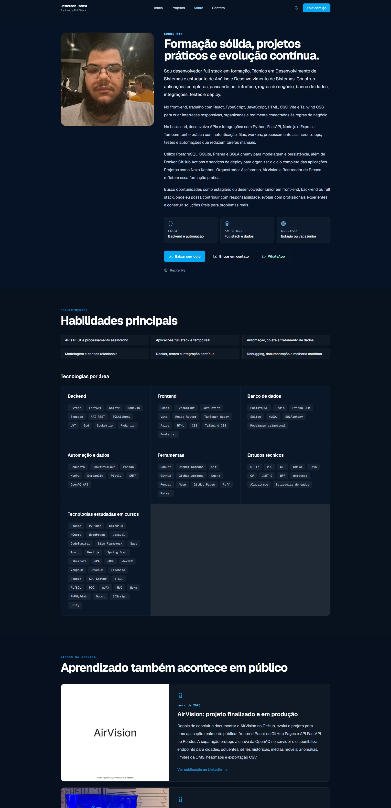
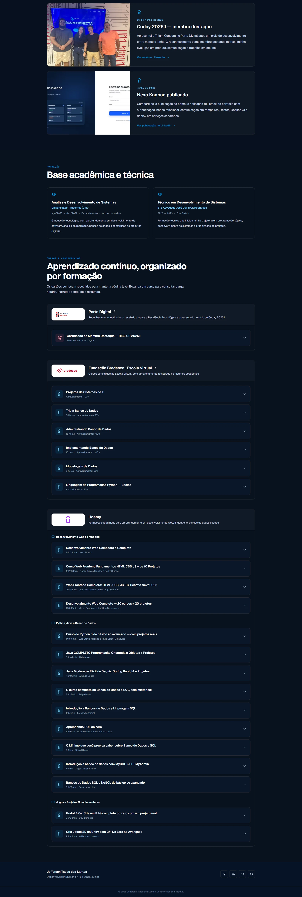
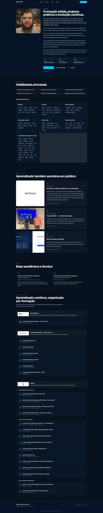
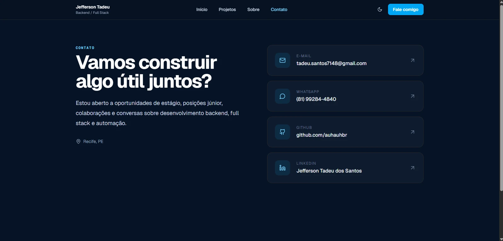
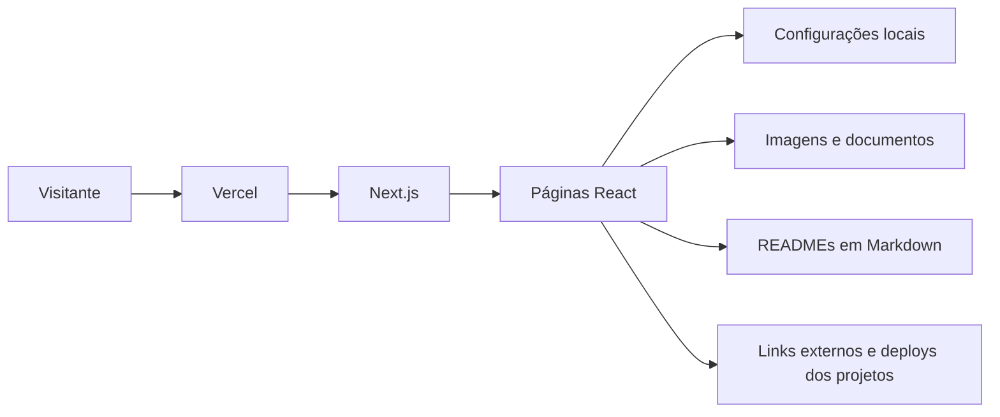

<a id="readme-top"></a>

<div align="center">
  <a href="https://jeffersontadeu.vercel.app">
    
  </a>

  <h1>Portfólio — Jefferson Tadeu</h1>

  <p>
    Portfólio profissional desenvolvido com Next.js para apresentar minha
    trajetória, projetos, tecnologias, certificados e formas de contato.
  </p>

  <p>
    <a href="https://jeffersontadeu.vercel.app"><strong>Acessar portfólio publicado</strong></a>
  </p>

  <p>
    <a href="https://jeffersontadeu.vercel.app">
      
    </a>
    <a href="https://github.com/auhauhbr">
      
    </a>
    <a href="https://www.linkedin.com/in/jefferson-tadeu-dos-santos-0ab133380">
      
    </a>
  </p>

  <p>
    
    
    
    
    
  </p>
</div>

## Sobre o projeto

Este repositório contém o código do meu portfólio pessoal. A aplicação foi
adaptada para funcionar como uma apresentação completa do meu perfil
profissional, reunindo:

- resumo e trajetória profissional;
- projetos autorais, acadêmicos e estudos técnicos;
- filtros de projetos por área e tecnologia;
- galerias com imagens e diagramas;
- detalhes completos de cada projeto;
- visualização expansível dos READMEs dos repositórios;
- tecnologias utilizadas e estudadas;
- formação acadêmica, cursos e certificados;
- marcos publicados no LinkedIn;
- currículo de uma página para download;
- contatos por e-mail, LinkedIn, GitHub e WhatsApp;
- tema claro e escuro;
- layout responsivo para computadores e dispositivos móveis.

## Capturas de tela

### Página inicial

<a href="docs/screenshots/home-hero.webp">
  
</a>

### Tecnologias e projetos em destaque

<a href="docs/screenshots/home-tecnologias-projetos.webp">
  
</a>

<a href="docs/screenshots/projeto-orquestrador.webp">
  
</a>

### Projetos, filtros e trajetória

<a href="docs/screenshots/projetos-filtros.webp">
  
</a>

<a href="docs/screenshots/trajetoria-conquistas.webp">
  
</a>

### Sobre mim

A captura original desta página é muito extensa para permanecer legível
diretamente no README. Por isso, ela foi dividida em duas partes e a versão
completa continua disponível logo abaixo.

<a href="docs/screenshots/sobre-perfil-habilidades.webp">
  
</a>

<a href="docs/screenshots/sobre-formacao-certificados.webp">
  
</a>

<details>
  <summary><strong>Ver captura completa da página Sobre</strong></summary>
  <br>
  <a href="docs/screenshots/sobre-completo.webp">
    
  </a>
</details>

### Contato

<a href="docs/screenshots/contato.webp">
  
</a>

## Arquitetura do portfólio

O portfólio é uma aplicação **frontend em Next.js**, utilizando o App Router.
Ele não possui API, banco de dados ou backend próprio.



Os textos, projetos, cursos e contatos são definidos localmente em arquivos
TypeScript. Imagens, READMEs e currículo ficam na pasta `public`. A Vercel
realiza o build e disponibiliza a aplicação publicamente.

> Os backends, APIs e bancos de dados apresentados nos cards pertencem aos
> projetos do portfólio, como AirVision, Nexo Kanban e Orquestrador Assíncrono.
> Eles não fazem parte da infraestrutura deste site.

## Tecnologias utilizadas

| Tecnologia | Onde foi utilizada |
|---|---|
| [![Next.js][next-badge]][next-url] | Framework, App Router, páginas, metadados, fontes e otimização de imagens |
| [![React][react-badge]][react-url] | Componentes, estado dos filtros, galerias, modais e interações |
| [![TypeScript][typescript-badge]][typescript-url] | Tipagem das configurações, projetos, cursos e componentes |
| [![Tailwind CSS][tailwind-badge]][tailwind-url] | Layout responsivo, cores, tipografia, temas e componentes visuais |
| [![Framer Motion][motion-badge]][motion-url] | Animações de entrada e transições dos projetos |
| [![Radix UI][radix-badge]][radix-url] | Modal acessível de detalhes dos projetos e primitivas de interface |
| [![Lucide][lucide-badge]][lucide-url] | Ícones da navegação, contatos, filtros e seções |
| [![Markdown][markdown-badge]][markdown-url] | Renderização dos READMEs com tabelas, listas, links e imagens |
| [![Vercel][vercel-badge]][vercel-url] | Hospedagem, build e deploy de produção |

Outras bibliotecas relevantes:

- `next-themes` para alternância entre tema claro e escuro;
- `react-markdown` e `remark-gfm` para os READMEs;
- `clsx` e `tailwind-merge` para composição de classes;
- ESLint para análise estática e padronização.

## Principais adaptações realizadas

O template inicial foi profundamente adaptado para o meu perfil. Entre as
principais alterações estão:

- tradução integral da interface para português;
- substituição de toda a identidade, textos e dados demonstrativos;
- nova estrutura de dados para projetos, tecnologias, cursos e certificados;
- catálogo com oito projetos reais e categorias personalizadas;
- filtros combinados por área e tecnologia;
- cards de tecnologia com logos e identificadores;
- galerias responsivas com múltiplas imagens;
- modal detalhado para cada projeto;
- README completo e recolhido dentro dos detalhes;
- carregamento sob demanda do Markdown;
- arquitetura e imagens específicas dos projetos;
- seção de trajetória e conquistas;
- posts importantes do LinkedIn;
- certificado de membro destaque do Porto Digital;
- cursos da Fundação Bradesco e Udemy com detalhes expansíveis;
- faixa animada com tecnologias utilizadas e estudadas;
- contatos com WhatsApp;
- currículo personalizado gerado em PDF;
- SEO e metadados em português;
- publicação na Vercel com domínio curto.

## Páginas

| Rota | Conteúdo |
|---|---|
| `/` | Apresentação, tecnologias, projetos em destaque e conquistas |
| `/projects` | Catálogo completo, filtros e detalhes dos projetos |
| `/about` | Trajetória, habilidades, formação e certificados |
| `/contact` | E-mail, GitHub, LinkedIn e WhatsApp |

## Estrutura principal

```text
portfolio-template/
├── app/
│   ├── about/
│   ├── contact/
│   ├── projects/
│   ├── globals.css
│   ├── layout.tsx
│   └── page.tsx
├── src/
│   ├── components/
│   │   ├── about/
│   │   ├── home/
│   │   ├── layout/
│   │   ├── projects/
│   │   └── ui/
│   ├── config/
│   │   ├── courses.ts
│   │   ├── portfolio.ts
│   │   └── technologies.ts
│   └── lib/
├── public/
│   ├── brands/
│   ├── documents/
│   ├── images/
│   ├── readmes/
│   └── tech/
└── scripts/
    └── generate_resume.py
```

## Como executar

### Pré-requisitos

- Node.js 20.9 ou superior;
- npm.

### Instalação

```bash
git clone https://github.com/auhauhbr/portfolio-jefferson-tadeu.git
cd portfolio-jefferson-tadeu
npm install
```

### Ambiente de desenvolvimento

```bash
npm run dev
```

Acesse [http://localhost:3000](http://localhost:3000).

### Validações

```bash
npm run lint
npm run build
```

### Produção local

```bash
npm run build
npm start
```

## Personalização dos dados

Os principais conteúdos estão centralizados em:

```text
src/config/portfolio.ts
src/config/courses.ts
src/config/technologies.ts
```

As imagens e documentos públicos ficam em:

```text
public/images/
public/documents/
public/readmes/
public/tech/
```

## Deploy

O projeto está publicado na Vercel:

**[jeffersontadeu.vercel.app](https://jeffersontadeu.vercel.app)**

Para criar outro deploy:

1. publique o repositório no GitHub;
2. acesse [vercel.com/new](https://vercel.com/new);
3. importe o repositório;
4. confirme o framework Next.js;
5. clique em **Deploy**.

Não são necessárias variáveis de ambiente para executar o portfólio.

## Créditos e atribuição

Este projeto **não foi criado inteiramente do zero**.

A base inicial foi o projeto público
[ElomariHana/portfolio-template](https://github.com/ElomariHana/portfolio-template),
desenvolvido por **Elomari Hana** e disponibilizado como template gratuito sob
licença MIT, conforme informado no README original.

O histórico original do Git foi preservado. A personalização, reestruturação,
novas funcionalidades, conteúdo, componentes adicionais, dados, imagens,
documentação e deploy deste repositório foram desenvolvidos para o portfólio de
**Jefferson Tadeu dos Santos**.

Consulte também o arquivo [NOTICE.md](NOTICE.md).

## Conteúdo pessoal

O código derivado do template segue as condições da licença original. Fotografias,
currículo, textos biográficos, certificados e demais dados pessoais presentes
neste repositório não devem ser reutilizados como dados de terceiros.

## Contato

- Portfólio: [jeffersontadeu.vercel.app](https://jeffersontadeu.vercel.app)
- GitHub: [github.com/auhauhbr](https://github.com/auhauhbr)
- LinkedIn: [Jefferson Tadeu dos Santos](https://www.linkedin.com/in/jefferson-tadeu-dos-santos-0ab133380)
- E-mail: [tadeu.santos7148@gmail.com](mailto:tadeu.santos7148@gmail.com)

<p align="right">(<a href="#readme-top">voltar ao topo</a>)</p>

[next-badge]: https://img.shields.io/badge/Next.js_16-000000?style=for-the-badge&logo=nextdotjs
[next-url]: https://nextjs.org/
[react-badge]: https://img.shields.io/badge/React_19-20232A?style=for-the-badge&logo=react&logoColor=61DAFB
[react-url]: https://react.dev/
[typescript-badge]: https://img.shields.io/badge/TypeScript-3178C6?style=for-the-badge&logo=typescript&logoColor=white
[typescript-url]: https://www.typescriptlang.org/
[tailwind-badge]: https://img.shields.io/badge/Tailwind_CSS_4-06B6D4?style=for-the-badge&logo=tailwindcss&logoColor=white
[tailwind-url]: https://tailwindcss.com/
[motion-badge]: https://img.shields.io/badge/Framer_Motion-0055FF?style=for-the-badge&logo=framer&logoColor=white
[motion-url]: https://motion.dev/
[radix-badge]: https://img.shields.io/badge/Radix_UI-161618?style=for-the-badge&logo=radixui
[radix-url]: https://www.radix-ui.com/
[lucide-badge]: https://img.shields.io/badge/Lucide_React-F56565?style=for-the-badge&logo=lucide&logoColor=white
[lucide-url]: https://lucide.dev/
[markdown-badge]: https://img.shields.io/badge/React_Markdown-000000?style=for-the-badge&logo=markdown
[markdown-url]: https://github.com/remarkjs/react-markdown
[vercel-badge]: https://img.shields.io/badge/Vercel-000000?style=for-the-badge&logo=vercel
[vercel-url]: https://vercel.com/
