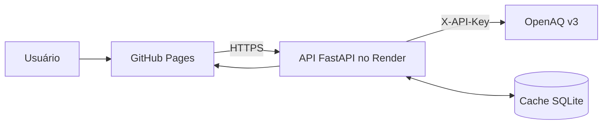

# AirVision

Dashboard web para consulta e análise histórica da qualidade do ar, com dados reais da [OpenAQ v3](https://docs.openaq.org/).

[Acessar o AirVision](https://auhauhbr.github.io/AirVision-qualidade-do-ar/) · [Verificar a API](https://airvision-api.onrender.com/api/health)


## Sobre o projeto

O AirVision transforma medições de estações ambientais em indicadores e visualizações interativas. O usuário escolhe país, cidade, poluente e período; o frontend consulta a API FastAPI, que busca os sensores disponíveis na OpenAQ, processa os registros e devolve os dados prontos para os gráficos.

### Funcionalidades

- Filtros por país, cidade, poluente e período.
- Suporte a PM2.5, PM10, NO₂, O₃, CO e SO₂.
- Série temporal interativa com tooltip, limite recomendado pela OMS e zoom.
- Médias móveis de 7 e 14 dias.
- Identificação de anomalias e dias críticos.
- Cards de média, pior dia, conformidade OMS e tendência anual.
- Lista das estações utilizadas na agregação.
- Heatmap de hora por dia da semana.
- Exportação dos dados filtrados em CSV.
- Cache local em SQLite para reduzir chamadas repetidas à OpenAQ.
- Modo demonstrativo quando uma cidade não possui cobertura recente.

## Visualizações

### Média móvel e tooltip


### Detecção de anomalias


## Arquitetura



- **Frontend:** React, Vite e Plotly.
- **Backend:** FastAPI, pandas e NumPy.
- **Dados:** OpenAQ v3.
- **Cache:** SQLite.
- **Frontend em produção:** GitHub Pages.
- **Backend em produção:** Render.
- **CI/CD:** GitHub Actions.

O segredo `OPENAQ_API_KEY` existe somente no backend. Ele nunca é incluído no bundle React nem enviado ao GitHub Pages.

## Estrutura

```text
Air vision/
├── .github/
│   └── workflows/
│       └── publicar-pages.yml
├── backend/
│   ├── app/
│   │   ├── analytics.py
│   │   ├── cache.py
│   │   ├── cities.py
│   │   ├── config.py
│   │   ├── main.py
│   │   ├── models.py
│   │   └── openaq.py
│   └── tests/
├── docs/
│   └── images/
├── frontend/
│   ├── src/
│   │   ├── services/
│   │   ├── main.jsx
│   │   └── styles.css
│   ├── index.html
│   ├── package.json
│   └── vite.config.js
├── .env.example
├── .python-version
├── render.yaml
└── requirements.txt
```

## Executar localmente

### Requisitos

- Python 3.13
- Node.js 22 ou superior
- Uma chave da OpenAQ

### 1. Preparar o backend

```powershell
python -m venv .venv
.\.venv\Scripts\Activate.ps1
pip install -r requirements.txt
Copy-Item .env.example .env
```

No arquivo `.env`, preencha:

```env
OPENAQ_API_KEY=sua_chave_openaq
AIRVISION_DB_PATH=backend/airvision.db
AIRVISION_CACHE_TTL_MINUTES=360
CORS_ORIGINS=http://localhost:5173,http://127.0.0.1:5173,http://localhost:8000,http://127.0.0.1:8000
```

O `.env` está no `.gitignore` e não deve ser versionado.

### 2. Instalar o frontend

```powershell
cd frontend
npm install
cd ..
```

### 3. Desenvolvimento

Backend:

```powershell
.\.venv\Scripts\Activate.ps1
uvicorn backend.app.main:app --reload --host 127.0.0.1 --port 8000
```

Frontend, em outro terminal:

```powershell
cd frontend
npm run dev
```

Acesse `http://127.0.0.1:5173`.

### Executar em uma porta

```powershell
cd frontend
npm run build
cd ..
uvicorn backend.app.main:app --reload --host 127.0.0.1 --port 8000
```

Acesse `http://127.0.0.1:8000`. Caso a porta esteja ocupada, use outra, como `8001`.

## API

### Saúde

```http
GET /api/health
```

### Opções dos filtros

```http
GET /api/options
```

### Medições processadas

```http
GET /api/measurements?city=Rio%20de%20Janeiro&country=BR&parameter=pm25&days=30
```

Parâmetros:

| Campo | Exemplo | Descrição |
|---|---|---|
| `city` | `Rio de Janeiro` | Cidade cadastrada no AirVision |
| `country` | `BR` | Código ISO do país |
| `parameter` | `pm25` | Poluente consultado |
| `days` | `30` | Período entre 7 e 365 dias |

Quando `source` é `openaq`, a consulta veio da OpenAQ. Quando é `cache`, são dados reais anteriormente armazenados. Quando é `demo`, não havia cobertura recente para a combinação escolhida ou a API estava indisponível.

## Testes

```powershell
.\.venv\Scripts\Activate.ps1
python -m pytest backend/tests -q -p no:cacheprovider
```

Build do frontend:

```powershell
cd frontend
npm run build
```

## Deploy

### Backend no Render

O arquivo `render.yaml` define:

- Python 3.13.
- Instalação por `requirements.txt`.
- Inicialização do Uvicorn.
- Health check em `/api/health`.
- Cache SQLite temporário em `/tmp/airvision.db`.
- CORS para `https://auhauhbr.github.io`.

No Render, configure o segredo:

```text
OPENAQ_API_KEY
```

Backend atual:

```text
https://airvision-api.onrender.com
```

Instâncias gratuitas podem entrar em repouso. A primeira requisição após um período sem acessos pode demorar cerca de 50 segundos.

### Frontend no GitHub Pages

O workflow `.github/workflows/publicar-pages.yml` executa automaticamente em cada push para `main`.

No repositório GitHub:

1. Acesse **Settings > Pages**.
2. Escolha **GitHub Actions** como fonte.
3. Em **Settings > Secrets and variables > Actions > Variables**, configure:

```text
VITE_API_BASE_URL=https://airvision-api.onrender.com
```

Site atual:

```text
https://auhauhbr.github.io/AirVision-qualidade-do-ar/
```

Não coloque a chave OpenAQ em nenhuma variável `VITE_*`, pois essas variáveis ficam visíveis no navegador.

## Cobertura dos dados

A presença de uma cidade na lista não garante que todos os poluentes possuam sensores ou medições recentes. A cobertura depende das estações publicadas na OpenAQ.

Por exemplo, uma cidade pode ter PM2.5 disponível, mas não possuir dados recentes para CO ou SO₂. Nesses casos, o AirVision informa que está usando o modo demonstrativo em vez de apresentar os valores simulados como dados reais.

## Referências

- [OpenAQ API](https://docs.openaq.org/)
- [OpenAQ API Key](https://docs.openaq.org/using-the-api/api-key)
- [Render: deploy de FastAPI](https://render.com/docs/deploy-fastapi)
- [GitHub Pages](https://docs.github.com/pages)
- [Plotly JavaScript](https://plotly.com/javascript/)
