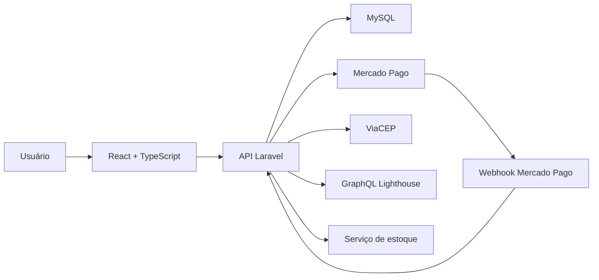
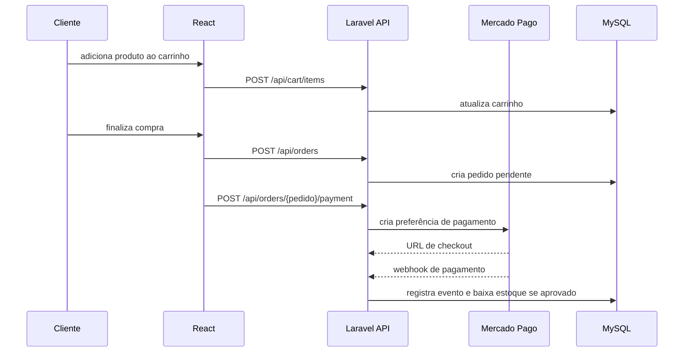

<a id="readme-top"></a>

<div align="center">
  

  <h1>Lumora</h1>

  <p>
    E-commerce brasileiro de tecnologia, periféricos e produtos conectados,
    publicado no Railway com Laravel, React/Vite, MySQL/MariaDB, Sanctum,
    Mercado Pago, ViaCEP e fila em banco de dados.
  </p>

  <p>
    <a href="https://lumora-eccomerce-em-laravel-react-production.up.railway.app">
      
    </a>
  </p>

  <p>
    
    
    
    
  </p>

  <p>
    <a href="https://jeffersontadeu.vercel.app">
      
    </a>
    <a href="https://github.com/auhauhbr">
      
    </a>
    <a href="https://www.linkedin.com/in/jefferson-tadeu-dos-santos-0ab133380">
      
    </a>
  </p>

  <p>
    
    
    
    
    
    
    
    
  </p>
</div>

## Sobre o projeto

Lumora é uma aplicação fullstack de e-commerce criada para simular uma loja de
produtos de tecnologia no contexto brasileiro. O projeto prioriza uma
experiência realista de compra: catálogo, filtros, detalhes do produto,
carrinho, checkout, pedidos, estoque, painel administrativo, consulta de CEP,
autenticação por token e pagamento com Mercado Pago.

Aplicação publicada:

<p>
  <a href="https://lumora-eccomerce-em-laravel-react-production.up.railway.app">
    <strong>https://lumora-eccomerce-em-laravel-react-production.up.railway.app</strong>
  </a>
</p>

A identidade visual segue uma linha institucional-moderna, com azul profundo,
ciano, verde, tipografia IBM Plex Sans e brilhos discretos para preservar uma
estética séria e tecnológica.

## Principais recursos

- catálogo público com busca, paginação, filtros por categoria, marca, condição,
  preço e disponibilidade;
- cadastro administrativo de categorias e marcas reutilizáveis;
- visualização em grade ou lista, com cards responsivos e largura controlada;
- página de produto com galeria, miniaturas, efeito de zoom, Pix, parcelamento,
  estoque e perguntas frequentes;
- cadastro, login e autenticação por token com Laravel Sanctum;
- carrinho lateral conectado à API;
- checkout em etapas com endereço, revisão e pagamento;
- consulta de CEP via ViaCEP;
- criação real de pedido a partir do carrinho;
- integração com Mercado Pago Checkout Pro;
- webhook de pagamento com processamento idempotente;
- baixa de estoque somente após pagamento aprovado;
- painel administrativo com dashboard, produtos, estoque e pedidos;
- fila em banco de dados para operação compatível com deploy simples;
- GraphQL com Lighthouse para consulta de catálogo;
- scripts e documentação de deploy para Railway, Nginx, systemd e Supervisor;
- dados iniciais com produtos reais de exemplo e imagens externas;
- fallback visual caso uma imagem de produto não carregue.

## Capturas de tela

### Catálogo do usuário

<a href="docs/screenshots/catalogo-usuario.png">
  
</a>

### Detalhe do produto

<a href="docs/screenshots/produto-detalhe.png">
  
</a>

### Área do cliente

<a href="docs/screenshots/perfil-cliente.png">
  
</a>

## Arquitetura



O front-end é renderizado pelo Laravel com Vite e consome as rotas da própria
API. O back-end concentra regras de carrinho, pedidos, estoque, pagamento,
webhook e permissões administrativas.

## Tecnologias utilizadas

| Tecnologia | Onde foi utilizada |
|---|---|
| [![Laravel][laravel-badge]][laravel-url] | API, rotas, controladores, validações, serviços, migrations e regras de negócio |
| [![PHP][php-badge]][php-url] | Back-end, integração Mercado Pago, webhooks e domínio da aplicação |
| [![MySQL][mysql-badge]][mysql-url] | Persistência de usuários, produtos, carrinho, pedidos, endereços e estoque |
| [![React][react-badge]][react-url] | Interface da loja, catálogo, carrinho, checkout, conta e painel administrativo |
| [![TypeScript][typescript-badge]][typescript-url] | Tipagem dos componentes, dados de catálogo, pedidos, usuários e chamadas de API |
| [![Vite][vite-badge]][vite-url] | Build do front-end integrado ao Laravel |
| [![GraphQL][graphql-badge]][graphql-url] | Endpoint `/graphql` com consultas de produtos e categorias |
| [![Mercado Pago][mercadopago-badge]][mercadopago-url] | Checkout Pro, Pix, cartão, retorno de pagamento e webhook |
| [![ViaCEP][viacep-badge]][viacep-url] | Consulta de CEP e preenchimento de endereço no checkout |
| [![Sanctum][sanctum-badge]][sanctum-url] | Autenticação por token e proteção de rotas privadas |
| [![Railway][railway-badge]][railway-url] | Deploy da aplicação, banco MySQL/MariaDB e preparação para worker separado |

## Fluxo de compra



## Estrutura principal

```text
lumora-laravel-react/
├── app/
│   ├── Enumeracoes/
│   ├── GraphQL/
│   ├── Http/
│   │   ├── Controladores/
│   │   ├── Intermediarios/
│   │   └── Requisicoes/
│   ├── Modelos/
│   ├── Pagamentos/
│   └── Servicos/
├── database/
│   ├── fabricas/
│   ├── migrations/
│   └── semeadores/
├── deploy/
│   ├── nginx/
│   ├── supervisor/
│   └── systemd/
├── docs/
├── graphql/
├── public/
│   ├── build/
│   └── imagens/
│       └── marca/
├── railway/
├── resources/
│   ├── css/
│   ├── js/
│   │   ├── aplicacao/
│   │   ├── componentes/
│   │   ├── servicos/
│   │   └── tipos/
│   └── views/
├── routes/
└── tests/
```

## Como executar localmente no CachyOS/Linux

### Pré-requisitos

- PHP 8.3 ou superior;
- Composer;
- MySQL 8 ou MariaDB compatível;
- Node.js 20 ou superior;
- npm.

No CachyOS/Arch, uma base típica é:

```bash
sudo pacman -Syu
sudo pacman -S php composer nodejs npm mariadb git unzip curl
```

Habilite as extensões PHP necessárias no `php.ini`, especialmente `pdo_mysql`,
`curl`, `openssl`, `mbstring`, `fileinfo`, `dom`, `xml`, `xmlwriter`, `zip`,
`iconv` e, para testes, `pdo_sqlite`/`sqlite3`.

### Instalação

```bash
composer install
npm ci
cp .env.example .env
php artisan key:generate
```

Depois de copiar o arquivo, ajuste os valores locais no `.env`. Nunca use
credenciais reais em arquivos versionados.

### Banco de dados local

Crie um banco MySQL/MariaDB local chamado `lumora` e configure o `.env` local:

```env
DB_CONNECTION
DB_HOST
DB_PORT
DB_DATABASE
DB_USERNAME
DB_PASSWORD
```

Depois rode:

```bash
php artisan migrate --seed
```

O `.env` real é local e nunca deve ser versionado.

### Front-end

Para desenvolvimento:

```bash
npm run dev
```

Para build de produção:

```bash
npm run build
```

### Testes e validações

```bash
php artisan test
npm run build
npx tsc --noEmit
```

### Servidor Laravel

```bash
php artisan serve
```

Acesse:

```text
http://127.0.0.1:8000
```

## Usuários de desenvolvimento

Os usuários criados pelo seeder usam estes e-mails por padrão:

| Papel | E-mail | Senha |
|---|---|---|
| Administrador | `admin@lumora.com.br` | configurada em `SEED_ADMIN_PASSWORD` |
| Cliente | `cliente@lumora.com.br` | configurada em `SEED_CUSTOMER_PASSWORD` |

Configure as senhas localmente no `.env`:

```env
SEED_ADMIN_EMAIL
SEED_ADMIN_PASSWORD
SEED_CUSTOMER_EMAIL
SEED_CUSTOMER_PASSWORD
```

Use senhas fortes e diferentes em cada ambiente. Não publique essas credenciais
em README, scripts, prints, issues ou pull requests.

## Mercado Pago

Configure localmente no `.env` ou, em produção, nas variáveis do Railway:

```env
MERCADO_PAGO_ACCESS_TOKEN
MERCADO_PAGO_PUBLIC_KEY
MERCADO_PAGO_WEBHOOK_SECRET
MERCADO_PAGO_SANDBOX
APP_URL
FRONTEND_URL
```

Durante desenvolvimento local, `MERCADO_PAGO_WEBHOOK_SECRET` pode ficar vazio.
Nesse caso, o webhook aceita notificações sem validar assinatura. Em produção, o
segredo do webhook deve ser configurado no painel do Mercado Pago e informado
somente como variável de ambiente.

Webhook de produção:

```text
https://lumora-eccomerce-em-laravel-react-production.up.railway.app/api/webhooks/mercado-pago
```

## Deploy seguro

O projeto está publicado no Railway:

<p>
  <a href="https://lumora-eccomerce-em-laravel-react-production.up.railway.app">
    
  </a>
</p>

O deploy completo usa:

- serviço de app Laravel + React/Vite;
- banco MySQL/MariaDB configurado por variáveis no painel do Railway;
- fila com `QUEUE_CONNECTION=database`;
- worker separado planejado/ideal para processar a fila continuamente;
- Mercado Pago e ViaCEP configurados por variáveis de ambiente.

Arquivos de deploy e operação:

```text
docs/deploy.md
railway/init-app.sh
railway/run-worker.sh
deploy/nginx/lumora.conf.example
deploy/systemd/lumora-queue.service.example
deploy/supervisor/lumora-queue.conf.example
```

Comandos usados no Railway:

```bash
# build
npm run build

# pre-deploy
chmod +x ./railway/init-app.sh && sh ./railway/init-app.sh

# worker
chmod +x ./railway/run-worker.sh && sh ./railway/run-worker.sh
```

`railway/init-app.sh` executa migrations com `--force` e caches Laravel. O
worker usa `php artisan queue:work database --sleep=3 --tries=3 --timeout=90`.

Consulte [docs/deploy.md](docs/deploy.md) antes de publicar mudanças. O deploy
de produção deve usar `APP_DEBUG=false`, HTTPS, cookies seguros, segredo de
webhook obrigatório, variáveis no Railway e rotação de qualquer chave exposta.

### Variáveis de ambiente

Configure no Railway ou no `.env` local, sempre sem versionar valores reais:

```env
APP_NAME
APP_ENV
APP_KEY
APP_DEBUG
APP_URL
FRONTEND_URL

DB_CONNECTION
DB_HOST
DB_PORT
DB_DATABASE
DB_USERNAME
DB_PASSWORD

CACHE_STORE
QUEUE_CONNECTION
SESSION_DRIVER
SESSION_ENCRYPT
SESSION_SECURE_COOKIE
SESSION_HTTP_ONLY
SESSION_SAME_SITE
SESSION_DOMAIN

SANCTUM_STATEFUL_DOMAINS
SANCTUM_TOKEN_PREFIX

VIACEP_URL
CA_BUNDLE_PATH

MERCADO_PAGO_ACCESS_TOKEN
MERCADO_PAGO_PUBLIC_KEY
MERCADO_PAGO_WEBHOOK_SECRET
MERCADO_PAGO_SANDBOX

SEED_ADMIN_EMAIL
SEED_ADMIN_PASSWORD
SEED_CUSTOMER_EMAIL
SEED_CUSTOMER_PASSWORD

MAIL_MAILER
MAIL_HOST
MAIL_PORT
MAIL_USERNAME
MAIL_PASSWORD
MAIL_FROM_ADDRESS
MAIL_FROM_NAME
```

### Segurança

- não commite `.env`, `.env.*`, `*.save`, `*.bak` ou `*~`;
- não publique `APP_KEY`, senha de banco, tokens do Mercado Pago, chaves de e-mail
  ou senhas de usuários;
- configure secrets no painel do Railway;
- rotacione qualquer chave que tenha sido exposta;
- não coloque senhas no README, scripts, Dockerfile, documentação ou issues.

## Rotas principais

### Autenticação

```text
POST /api/register
POST /api/login
POST /api/logout
GET  /api/me
```

### Catálogo

```text
GET /api/categories
GET /api/brands
GET /api/products
GET /api/products/{slug}
POST /graphql
```

Filtros aceitos em `/api/products`:

```text
search
category
brand
condition=novo|usado|recondicionado
min_price
max_price
in_stock
sort=price_asc|price_desc|name_desc
page
per_page
```

### Carrinho

```text
GET    /api/cart
POST   /api/cart/items
PATCH  /api/cart/items/{item}
DELETE /api/cart/items/{item}
DELETE /api/cart
```

### Endereços e pedidos

```text
GET    /api/addresses/zipcode/{cep}
GET    /api/addresses
POST   /api/addresses
DELETE /api/addresses/{endereco}

POST /api/orders
GET  /api/orders
GET  /api/orders/{pedido}
POST /api/orders/{pedido}/cancel
```

### Pagamentos

```text
POST /api/orders/{pedido}/payment
GET  /api/orders/{pedido}/payment-status
POST /api/webhooks/mercado-pago
```

### Administração

```text
GET    /api/admin/dashboard
GET    /api/admin/categories
POST   /api/admin/categories
PUT    /api/admin/categories/{slug}
PATCH  /api/admin/categories/{slug}/toggle-active
DELETE /api/admin/categories/{slug}

GET    /api/admin/brands
POST   /api/admin/brands
PUT    /api/admin/brands/{slug}
PATCH  /api/admin/brands/{slug}/toggle-active

GET    /api/admin/products
POST   /api/admin/products
PUT    /api/admin/products/{slug}
PATCH  /api/admin/products/{slug}/toggle-active
POST   /api/admin/products/{produto}/stock-adjustment

GET    /api/admin/orders
GET    /api/admin/orders/{pedido}
PATCH  /api/admin/orders/{pedido}/status

GET    /api/admin/payment-events
GET    /api/admin/stock-movements
```

## GraphQL

Endpoint:

```text
POST /graphql
```

Exemplo:

```graphql
query {
  products(category: "componentes", in_stock: true) {
    id
    name
    slug
    price
    stock
    available
    category {
      id
      name
      slug
    }
  }
}
```

## Validações úteis

```bash
npm run build
npx tsc --noEmit
php artisan test
```

## Contato

- Portfólio: [jeffersontadeu.vercel.app](https://jeffersontadeu.vercel.app)
- GitHub: [github.com/auhauhbr](https://github.com/auhauhbr)
- LinkedIn: [Jefferson Tadeu dos Santos](https://www.linkedin.com/in/jefferson-tadeu-dos-santos-0ab133380)
- E-mail: [tadeu.santos7148@gmail.com](mailto:tadeu.santos7148@gmail.com)

<p align="right">(<a href="#readme-top">voltar ao topo</a>)</p>

[laravel-badge]: https://img.shields.io/badge/Laravel-FF2D20?style=for-the-badge&logo=laravel&logoColor=white
[laravel-url]: https://laravel.com/
[php-badge]: https://img.shields.io/badge/PHP-777BB4?style=for-the-badge&logo=php&logoColor=white
[php-url]: https://www.php.net/
[mysql-badge]: https://img.shields.io/badge/MySQL-4479A1?style=for-the-badge&logo=mysql&logoColor=white
[mysql-url]: https://www.mysql.com/
[react-badge]: https://img.shields.io/badge/React-20232A?style=for-the-badge&logo=react&logoColor=61DAFB
[react-url]: https://react.dev/
[typescript-badge]: https://img.shields.io/badge/TypeScript-3178C6?style=for-the-badge&logo=typescript&logoColor=white
[typescript-url]: https://www.typescriptlang.org/
[vite-badge]: https://img.shields.io/badge/Vite-646CFF?style=for-the-badge&logo=vite&logoColor=white
[vite-url]: https://vite.dev/
[graphql-badge]: https://img.shields.io/badge/GraphQL-E10098?style=for-the-badge&logo=graphql&logoColor=white
[graphql-url]: https://graphql.org/
[mercadopago-badge]: https://img.shields.io/badge/Mercado_Pago-009EE3?style=for-the-badge
[mercadopago-url]: https://www.mercadopago.com.br/
[viacep-badge]: https://img.shields.io/badge/ViaCEP-0EA5E9?style=for-the-badge
[viacep-url]: https://viacep.com.br/
[sanctum-badge]: https://img.shields.io/badge/Laravel_Sanctum-FF2D20?style=for-the-badge&logo=laravel&logoColor=white
[sanctum-url]: https://laravel.com/docs/sanctum
[railway-badge]: https://img.shields.io/badge/Railway-0B0D0E?style=for-the-badge&logo=railway&logoColor=white
[railway-url]: https://railway.com/
