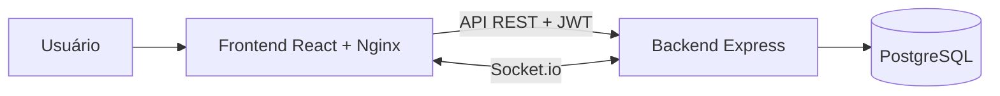

# Nexo

Nexo é uma aplicação Kanban full stack para organizar projetos em quadros,
listas e cartões. O sistema possui autenticação, movimentação por arrastar e
soltar, atualização em tempo real e ambiente completo com Docker.

## Aplicação publicada

- **Demonstração:** [https://auhauhbr.github.io/nexo-kanban/](https://auhauhbr.github.io/nexo-kanban/)
- **Status da API:** [https://nexo-kanban.onrender.com/health](https://nexo-kanban.onrender.com/health)

A versão pública utiliza uma arquitetura distribuída entre três serviços:

- **GitHub Pages:** hospeda o build estático do frontend React.
- **Render:** executa a API Node.js, as conexões Socket.io e as migrações do
  Prisma.
- **Neon:** fornece o banco PostgreSQL gerenciado utilizado em produção.

O frontend é publicado por um workflow manual do GitHub Actions. O backend é
atualizado automaticamente pelo Render após novos commits na branch `main`.

## Preview

### Autenticação

Login e cadastro integrados à identidade visual do Nexo. O cadastro apresenta
confirmação, requisitos e medidor progressivo de força da senha.

| Login | Cadastro seguro |
| --- | --- |
|  |  |

### Detalhes do cartão

Edição de título, descrição, prazo e capa, com comentários e anexos por link.


### Recursos e histórico

Etiquetas, checklists com progresso e histórico automático de atividades.


### Central de Arquivados

Consulta e restauração de cartões e listas arquivados.


## Funcionalidades

- Cadastro, login e sessão autenticada com JWT
- Criação, edição e exclusão de quadros
- Criação, renomeação, reordenação e exclusão de listas
- Criação, edição, movimentação e exclusão de cartões
- Numeração automática de cartões dentro de cada quadro
- Capas coloridas para destacar cartões visualmente
- Etiquetas coloridas compartilhadas entre cartões do quadro
- Prazos com destaque visual e alerta em tempo real quando estão próximos
- Checklists com itens marcáveis e progresso exibido no cartão
- Comentários e histórico automático de atividades dos cartões
- Anexos por links externos, com acesso direto pelo cartão
- Arquivamento de cartões e listas sem exibi-los no quadro ativo
- Central para consultar e restaurar cartões e listas arquivados
- Limite de trabalho em progresso (WIP limit) com alerta visual por lista
- Arrastar e soltar cartões entre listas
- Atualizações em tempo real com salas privadas por quadro
- Interface responsiva com estados de carregamento, erro e notificações
- Testes de integração da API e testes das regras de movimentação
- Validação automática com GitHub Actions

## Diferenciais atuais

O Nexo não possui planos pagos ou bloqueios por assinatura. Todos os recursos
implementados ficam disponíveis para qualquer usuário da aplicação.

Além do fluxo Kanban tradicional, o projeto já oferece:

- **Histórico automático de atividades:** registra criação, edição,
  movimentação, arquivamento e anexos adicionados ao cartão.
- **Comentários integrados ao histórico:** mensagens e alterações aparecem na
  mesma linha do tempo do cartão.
- **Identificação por número:** cada cartão recebe um número sequencial dentro
  do quadro, facilitando referências como `#12`.
- **Arquivamento separado da exclusão:** cartões e listas podem sair do quadro
  ativo sem serem excluídos permanentemente e podem ser restaurados pela
  Central de Arquivados.
- **WIP limit configurável:** cada lista pode exibir um limite recomendado de
  cartões e destacar visualmente quando o fluxo ultrapassa esse valor.
- **Recursos visuais e operacionais liberados:** capas, etiquetas, prazos,
  checklists, comentários, histórico e anexos por link não possuem paywall.

## Roadmap de diferenciais

Os recursos abaixo fazem parte da direção planejada do projeto, mas **ainda não
estão implementados**:

- **Subcards:** cartões filhos ligados a um cartão principal, cada um com seus
  próprios dados, responsáveis e progresso. É diferente de um checklist,
  porque o subcard continua sendo uma tarefa completa.
- **Dependências entre cartões:** relações como “bloqueado por” e “bloqueia”,
  permitindo identificar tarefas que não podem avançar antes de outras.
- **Desfazer ações:** restauração da alteração anterior após mover, editar ou
  arquivar um cartão.
- **Upload real de arquivos:** armazenamento de imagens, PDFs e documentos. No
  estado atual, os anexos são links externos.
- **Colaboração entre usuários:** membros, permissões e responsáveis por
  cartão. Atualmente, cada quadro pertence somente ao seu criador.

## Tecnologias

### Frontend

O frontend é uma aplicação React criada com Vite. Ele é responsável pelas
telas de autenticação, painel de quadros e área Kanban, além das interações de
criação, edição, exclusão e arrastar e soltar.

- **React:** estrutura a interface em páginas, contextos e componentes
  reutilizáveis.
- **TypeScript:** tipa componentes, propriedades, respostas da API, quadros,
  listas, cartões e funções de movimentação.
- **Vite:** executa o ambiente de desenvolvimento e gera o build de produção.
- **TanStack Query:** busca dados da API, gerencia cache, refaz consultas e
  permite atualizações otimistas durante movimentações.
- **Axios:** centraliza as requisições HTTP e adiciona o token JWT às rotas
  protegidas.
- **React Router:** controla as páginas públicas e protegidas.
- **Socket.io Client:** recebe atualizações do quadro sem recarregar a página.
- **Lucide React:** fornece os ícones da interface.

### Backend

O backend concentra as regras de negócio e expõe uma API REST. Ele verifica a
identidade do usuário, protege o acesso aos dados e mantém as posições de
listas e cartões consistentes durante as movimentações.

- **Node.js:** ambiente de execução da API.
- **Express:** organiza rotas, controladores e intermediários HTTP.
- **TypeScript:** tipa entradas, serviços, respostas, autenticação e integração
  com o Prisma.
- **Zod:** valida os dados recebidos antes de executar as regras de negócio.
- **JWT:** autentica requisições e conexões em tempo real.
- **bcryptjs:** protege as senhas antes de armazená-las.
- **Socket.io:** publica alterações somente para os clientes autorizados na
  sala de cada quadro.

### Banco de dados

- **PostgreSQL:** armazena usuários, quadros, listas e cartões em um modelo
  relacional, além de etiquetas, checklists, atividades e anexos por link.
- **Prisma ORM:** define o modelo de dados, gera o cliente tipado, executa
  consultas e controla as migrações do banco.
- **Transações:** preservam a ordenação de listas e cartões durante alterações
  que atualizam vários registros.

### Docker e execução

- **Docker Compose:** inicia PostgreSQL, backend e frontend como serviços
  separados e conectados.
- **Dockerfile do backend:** gera o cliente Prisma, compila o TypeScript, aplica
  migrações pendentes e inicia a API.
- **Dockerfile do frontend:** gera o build de produção da aplicação React.
- **Nginx:** serve os arquivos do frontend e mantém as rotas do React
  disponíveis ao atualizar a página.
- **Volumes:** preservam os dados do PostgreSQL mesmo após encerrar os
  contêineres.

### Testes e qualidade

- **Node Test Runner:** executa os testes automatizados.
- **Testes de integração:** validam autenticação, autorização, CRUD, ordenação e
  eventos em tempo real usando o banco.
- **Testes do frontend:** validam as regras de movimentação de listas e cartões.
- **GitHub Actions:** cria um PostgreSQL temporário e executa migrações, testes,
  verificação de tipos e build a cada envio ao GitHub.

## Desenvolvimento e assistência de IA

O projeto foi desenvolvido como um estudo prático de arquitetura full stack,
com foco na construção do backend em TypeScript, regras de negócio,
autenticação, banco PostgreSQL, integração em tempo real, testes e
containerização com Docker.

Ferramentas de inteligência artificial foram utilizadas como apoio no
refinamento do frontend, principalmente em decisões de apresentação visual,
responsividade, organização de componentes e melhorias de experiência do
usuário. A assistência foi aplicada sobre a estrutura funcional do sistema e
não substitui a implementação da API, da modelagem do banco, das regras do
backend ou da infraestrutura Docker.

## Segurança

- Senhas são validadas no frontend e backend e armazenadas somente após hash
  com bcrypt.
- O cadastro exige confirmação da senha e mostra uma barra de força progressiva.
- A senha precisa ter 12 caracteres, maiúscula, minúscula, número, caractere
  especial e não pode repetir o mesmo caractere quatro vezes seguidas.
- Login e cadastro possuem limitação de tentativas por endereço IP.
- A API limita o tamanho de corpos JSON e envia cabeçalhos HTTP de segurança.
- Tokens JWT expiram após sete dias e rotas privadas verificam o usuário
  autenticado.
- Arquivos `.env` são ignorados pelo Git. O repositório contém apenas
  `.env.example`, sem credenciais utilizáveis.

O token JWT permanece armazenado no `localStorage` do navegador. Para um deploy
público com requisitos de segurança mais elevados, a evolução recomendada é
usar cookies `HttpOnly`, `Secure` e `SameSite`, além de HTTPS, rotação de
segredos e rate limiting compartilhado em Redis.

## Arquitetura



O frontend utiliza a API REST para persistir alterações e o Socket.io para
receber atualizações do quadro em tempo real. Cada conexão só pode entrar nas
salas dos quadros pertencentes ao usuário autenticado.

## Executar com Docker

### Aplicação completa

Com o Docker Desktop em execução:

Crie o arquivo local de variáveis antes da primeira execução:

```powershell
Copy-Item .env.example .env
```

Edite o `.env` e defina uma senha para o PostgreSQL e um segredo JWT longo e
aleatório. Esse arquivo não será enviado ao GitHub.

```bash
docker compose up -d --build
```

Depois, acesse:

- Aplicação: `http://localhost:5173`
- API: `http://localhost:3333`
- Saúde da API: `http://localhost:3333/health`

As migrações pendentes do Prisma são aplicadas automaticamente ao iniciar o
backend.

Para acompanhar ou encerrar os serviços:

```bash
docker compose ps
docker compose logs -f
docker compose down
```

O comando `docker compose down` não apaga os dados armazenados no volume do
PostgreSQL.

## Publicação

A aplicação está publicada com o frontend, backend e banco de dados executados
em serviços separados:

- **Frontend:** GitHub Pages, disponível em
  [auhauhbr.github.io/nexo-kanban](https://auhauhbr.github.io/nexo-kanban/).
- **Backend e Socket.io:** Render Web Service, disponível em
  [nexo-kanban.onrender.com](https://nexo-kanban.onrender.com/health).
- **Banco de dados:** PostgreSQL gerenciado pelo Neon, conectado ao backend por
  uma variável de ambiente protegida.

O workflow `Publicar frontend no GitHub Pages` gera o frontend com as variáveis
`VITE_API_URL` e `VITE_SOCKET_URL`, prepara o artefato estático e realiza a
publicação. No Render, o processo de deploy instala as dependências, gera o
cliente Prisma, compila o backend, aplica migrações pendentes e inicia a API.

Credenciais e endereços sensíveis permanecem fora do repositório, armazenados
como variáveis de ambiente nas plataformas. A API permite a origem do frontend
publicado por meio da configuração de CORS.

Por utilizar o plano gratuito do Render, a API pode entrar em modo de espera
após um período sem acessos. A primeira requisição após esse período pode levar
alguns segundos enquanto o serviço é reativado.

## Desenvolvimento local

### Requisitos

- Node.js 20 ou superior
- npm 10 ou superior
- Docker Desktop

Instale as dependências e crie o arquivo de ambiente do backend:

```bash
npm install
```

```powershell
Copy-Item backend/.env.example backend/.env
```

Inicie o banco:

```bash
docker compose up -d db
```

Em terminais separados, inicie a API e o frontend:

```bash
npm run dev:backend
npm run dev:frontend
```

## Comandos úteis

```bash
# Executa testes, verificação de tipos e build
npm run validar

# Executa somente os testes
npm test

# Cria e aplica uma nova migração
npm run db:migrate --workspace backend -- --name nome_da_migracao

# Abre a interface de dados do Prisma
npm run db:studio --workspace backend
```

## API

Todas as rotas, exceto cadastro e login, exigem o cabeçalho
`Authorization: Bearer <token>`.

| Método | Rota | Ação |
| --- | --- | --- |
| `POST` | `/auth/register` | Cria uma conta |
| `POST` | `/auth/login` | Autentica uma conta |
| `GET` | `/auth/me` | Retorna o usuário autenticado |
| `GET` | `/boards` | Lista os quadros do usuário |
| `POST` | `/boards` | Cria um quadro |
| `GET` | `/boards/:id` | Retorna um quadro com listas e cartões |
| `PATCH` | `/boards/:id` | Atualiza um quadro |
| `DELETE` | `/boards/:id` | Exclui um quadro |
| `POST` | `/boards/:boardId/lists` | Cria uma lista |
| `PATCH` | `/lists/:id` | Atualiza ou move uma lista |
| `PATCH` | `/lists/:id/restaurar` | Restaura uma lista arquivada |
| `DELETE` | `/lists/:id` | Exclui uma lista |
| `POST` | `/lists/:listId/cards` | Cria um cartão |
| `PATCH` | `/cards/:id` | Atualiza ou move um cartão |
| `PATCH` | `/cards/:id/restaurar` | Restaura um cartão arquivado |
| `DELETE` | `/cards/:id` | Exclui um cartão |
| `POST` | `/boards/:boardId/labels` | Cria uma etiqueta |
| `POST` | `/cards/:cardId/labels/:labelId` | Vincula uma etiqueta |
| `POST` | `/cards/:cardId/checklists` | Cria um checklist |
| `POST` | `/checklists/:checklistId/items` | Cria um item de checklist |
| `PATCH` | `/checklist-items/:id` | Atualiza um item de checklist |
| `POST` | `/cards/:cardId/activities` | Adiciona um comentário ao histórico |
| `POST` | `/cards/:cardId/attachments` | Adiciona um anexo por link |
| `DELETE` | `/attachments/:id` | Exclui um anexo por link |
| `GET` | `/boards/:id/archived` | Lista cartões e listas arquivados |
| `GET` | `/health` | Verifica a API e o banco |

## Tempo real

A conexão Socket.io exige o JWT em `auth.token`. Após a autenticação, o evento
`join-board` permite entrar somente na sala de um quadro pertencente ao usuário.

Alterações em quadros, listas e cartões são publicadas aos clientes conectados
à mesma sala. O frontend invalida o cache correspondente e sincroniza os dados
sem recarregar a página.

## Estrutura

```text
kanban-projeto/
├── backend/
│   ├── prisma/
│   └── src/
│       ├── configuracao/
│       ├── intermediarios/
│       ├── modulos/
│       ├── tempo-real/
│       └── testes/
├── frontend/
│   └── src/
│       ├── api/
│       ├── componentes/
│       ├── contexto/
│       ├── paginas/
│       ├── tempo-real/
│       └── testes/
├── .github/workflows/
└── docker-compose.yml
```
